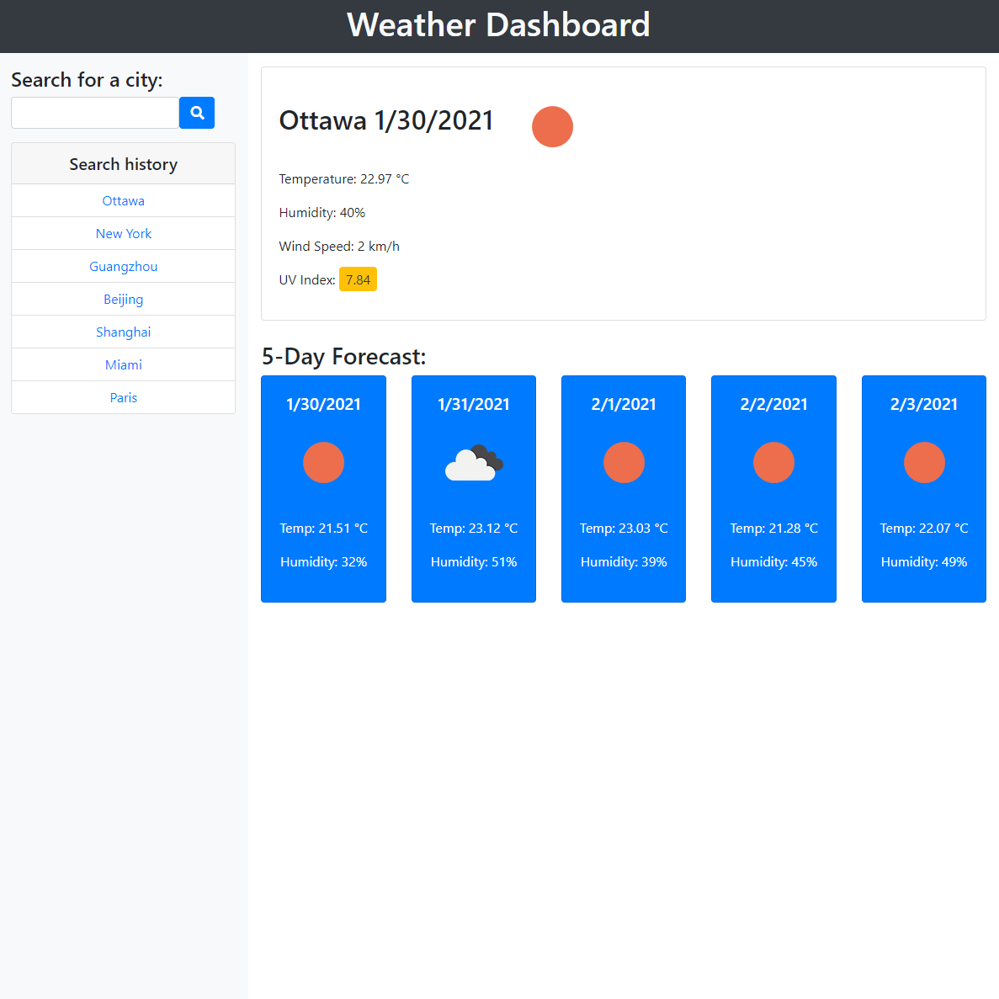

# To-read List

## Description

This application built openweather API allows user to search for weather of a city. Searching results temperature, humidity, wind speed, UV index as well as five day forecast of temperature and humidity. Search history and data are kept in local storage.

:link: [Link to view](https://to-read-list.herokuapp.com/)

## Built with

- Bootstrap
- OpenWeather APIs

## License

This application is covered under the **MIT license**.
